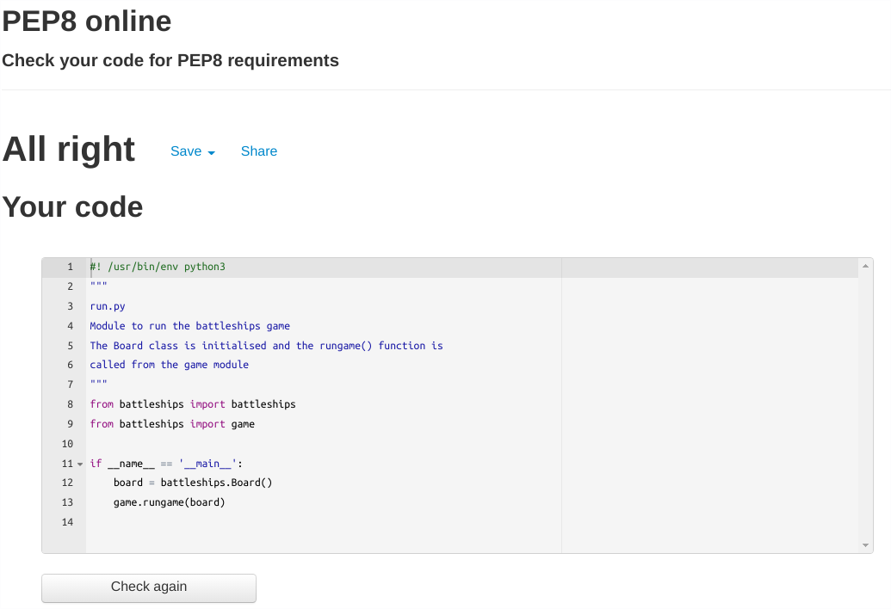
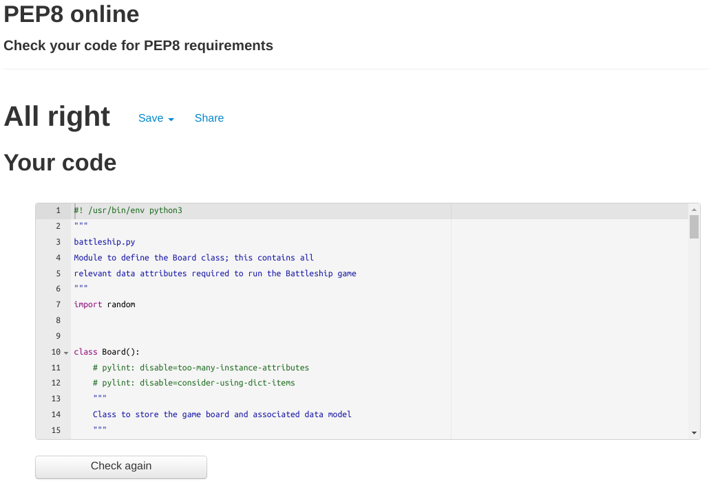
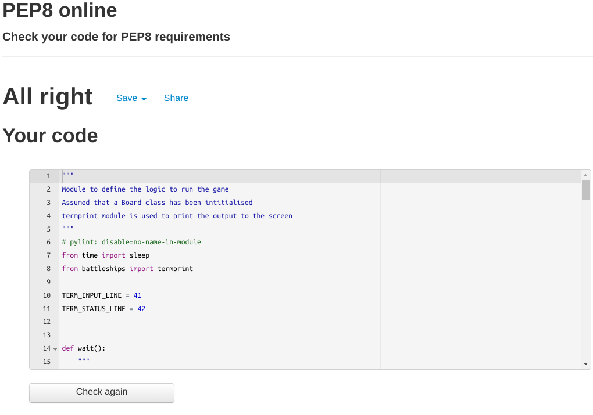
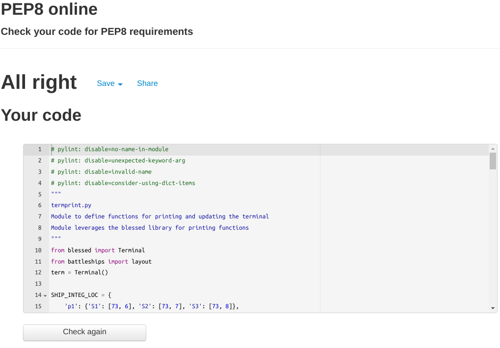

# Battleships Game

## Overview
`py-battleships` is an interactive terminal based Battleships game implemented in Python.

The game has a number of features, including:
- The `blessed` Python library for manipulation and control of the terminal
- A rich data model with a flexible and modular `Board()` class to store both game parammeters and game state
- Dashboard that provides an overview of the state of play of the current game
- A UX which provides a clear overview of the state of play of the current game and delivers rich user interaction

## Objective

The objective of the game was to develop a rich and fully featured Python application. In developing the game, I carefully considered the user experience, which led to the following user stories:

As a site user:

- I want a game where the terminal output is dynamic and does not rely on scrolling through terminal output
- I want a game that is easy to play with clear instructions
- I want a game with clear visual cues indicating the status of the game and the outcome of each game event

As a site owner:

- I want to ensure that the terminal interaction is user friendly and does not rely on repeated use of `print()` statements
- I want to ensure that the site has a strong visual identity
- I am less concerned whether the website is responsive; the assumption is that the game will be played from either a desktop or laptop
- I want to ensure that the underlying code leverages best practices and can be exteneded to other potential projects in the future

### Game Sequence:
- Get user name
- Get board size
- Place ships on board
- Display board to user
- Ask user for shot
- Display board with shot
- Iterate through game

___

## Features

The key features of the application are outlined below:

- Dynamic Terminal Output

- Data Validation

- User Friendly Interface

- Robust Data Model

- A dynamically updated Terminal window, implemented using the `blessed` Python library
- Error checking and validation of user input
- A clear interface that is easy to understand and use
- A robust data model; the Board class is implemented in line with Object Orientated Programming principles and is portable to other implementations of 

### Future

___

## Data Model

___

## Testing

### Validator Testing 

Each of the Python scripts were validated against PEP8 validation, with the following validator used [PEP8 Validator](http://pep8online.com/). 

For the `layout.py` file, the PEP8 validator indicated that several lines exceeded the recommended length of 80 characters. However, this file is solely used to store the string constants which define the game boards and instruction text that is printed during the game. It was decided not to modify this file to resolve the validator errors. 

No issues were detected. Results from the validation were as follows:

- 

  
<strong style="color:skyblue">run.py:</strong>

     <a href="./docs/pep8/pep8-run-py.txt" target="_blank">run.py PEP8 validation</a>
    
  

- 

  
<strong style="color:skyblue">battleship.py:</strong>

    <a href="./docs/pep8/pep8-battleship-py.txt" target="_blank">battleship.py PEP8 validation</a>
    
  

- 

  
<strong style="color:skyblue">game.py:</strong>

    <a href="./docs/pep8/pep8-battleship-py.txt" target="_blank">game.py PEP8 validation</a>
    
  

- 

  
<strong style="color:skyblue">layout.py:</strong>

    <a href="./docs/pep8/pep8-layout-py.txt" target="_blank">layout.py PEP8 validation</a>
  

- 

  
<strong style="color:skyblue">termprint.py:</strong>

    <a href="./docs/pep8/pep8-termprint-py.txt" target="_blank">termprint.py PEP8 validation</a>
    

  

___

## Deployment

The py-battleship repository was deployed using a `xterm.js` mock terminal to Herkou. 

The repoitory can be deployed as follows:
- Fork or clone the repository
- Create a new Heroku application
- For deployment, the `Python` and `NodeJS` buildpacks are required
- The foowing `Config Vars` are required:
    - PORT=8000
- Link the Heroku application to the repository
- Click *Deploy*

___

___

## Development

### Languages
- Python
- HTML
- CSS
- JavaScript
- jQuery

### Tools / Technologies

- **[VScode](https://code.visualstudio.com/)**  
All coding was completed in VS Code.
- **[Heroku](http://heroku.com/)**
Heroku was used for the deployment of the app.
- **[node-pty](https://github.com/microsoft/node-pty) and [xterm.js](https://github.com/xtermjs/xterm.js)**
These open source libraries were used to generate the web based terminal; these are integrated using a modified version of the CodeInstitute template
- **[blessed](https://github.com/jquast/blessed)
This Python library was used to dynamically update the Terminal window.
- **[coolors.co](https://coolors.co/)**  
Potential site palettes were tested with Coolors.  
- **[ASCII Art Generator](http://patorjk.com/software/taag/#p=display&f=ANSI%20Shadow&t=Battleships)**
This ASCII generator was used to create the game logo and welcome message
- **[gauger.io](https://gauger.io/fonticon/)**  
This website was used to generate the favicon using an icon from Font Awesome.
- **[Chrome Capture - Screenshots & Gifs](https://chrome.google.com/webstore/detail/chrome-capture-screenshot/ggaabchcecdbomdcnbahdfddfikjmphe)**
This was used to create the animated gif showing the game functionality.
- **[https://ecotrust-canada.github.io/](https://ecotrust-canada.github.io/markdown-toc/)**  
For generating the formatted table of contents in markdown
- **[cdnjs](https://cdnjs.com/libraries/jquery)**  
cdnjs was used as the reference for the `jQuery` and `xterm` libraries.
- **[Google Fonts](https://fonts.google.com/)**  
Used to provide the custom fonts for the site

## Credits & Attributions

- **[blessed Python library](https://github.com/jquast/blessed)
Example applications and reference documentation for the `blessed` library was used to help implement the library features 
- **[How to draw a continuous line in terminal?](https://unix.stackexchange.com/questions/559708/how-to-draw-a-continuous-line-in-terminal)
The following StackExchange article was referenced to understand how to print complex characters to the Terminal
- **[Disable xterm.js scroll bar](https://github.com/xtermjs/xterm.js/issues/3074)
This issue was referenced to determine how to disable the scroll bar in the Terminal window
- **[Setting xterm.js font size](https://github.com/xtermjs/xterm.js/blob/4.14.1/typings/xterm.d.ts#L1031)
The `xterm.js` documentation was referenced to understand how to modify the Terminal font size
- **[CSS Vertical Stripes](https://css-tricks.com/stripes-css/)
The followign tutorial was used to help implement the vertical stripes for the Terminal background

